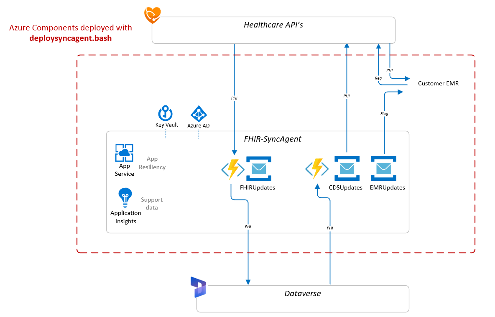
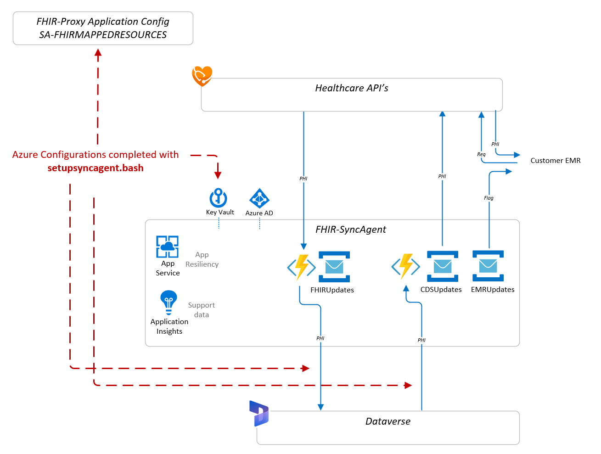

# Challenge 5 - FHIR SyncAgent (Instructor Lead Training)

## Introduction

Welcome to Challenge 5!

**Note This challenge requires a Dataverse Tenant, A Dataverse Environment, and a Dynamics Subscription to complete.** Given that most participants do not have this access, this is an instructor-lead training module. 
  
In this challenge you will learn how to download and install the Microsoft Cloud for Health FHIR-SyncAgent. 

## Background
FHIR data in MC4H is managed in the **Azure API for FHIR** data store, while MC4H model-driven apps are based on the **Dynamics** health industry data model in **Dataverse**. Leveraging Dataverse enables organizations to quickly stand up Power Apps for their unique needs. The FHIR-SyncAgent is a function app designed to keep data synchronized between the two data stores (Azure API for FHIR and Dataverse).  

Installing the FHIR-SyncAgent requires configuration in both Azure and Dynamics. The Azure installation is accomplished using the Azure Cloud Shell - Bash Shell environment, and the install on the Dynamics end is carried out via the Dynamics Solution Center.  

## Learning Objectives
+ Install and Configure the FHIR-SyncAgent service using the bash shell scripts 
+ Deploy and Config the Sync Admin for FHIR administration application 

### SyncAgent, API for FHIR and Dynamics Relationship 
The SyncAgent acts as a 2-way communication processor between Azure API for FHIR and Dynamics. Requirements (not all pictured below) include 
- FHIR-Proxy deployed with Azure API for FHIR
- Service Client information from the Dynamics Tenant (the Dynamics Tenant must be separate from the Azure API for FHIR/FHIR-Proxy tenant)




## Prerequisites
+ Successful completion of Challenge 1 
+ Access the Private GitHub Repo holding the FHIR-SyncAgent (Microsoft personnel)
+ Use a Personnel Access Token to clone the repo (Microsoft personnel)

## Getting Started
Azure FHIR Sync Agent includes two components:
- FHIR Sync Agent service (Azure)
- Sync admin for FHIR application (Dynamics)

Both components are required in order for clinical information to properly flow between Azure API for FHIR and Dataverse.
  
The FHIR Sync Agent service consists of Azure services that are deployed directly within your Azure Subscription. 
  
Sync admin for FHIR is deployed automatically when you deploy any of the Dynamics 365 healthcare solutions through the Microsoft Cloud Solution Center.

### Azure 
Deploying MC4H FHIR-SyncAgent service
For this challenge, we will walk through these steps: 
- Login to Azure CLI (via the Portal or directly at shell.azure.com)
- Clone the FHIR-CDS-Agent repo  
- Execute the deployment and setup scripts 

### Dynamics 
- Configure a sync agent application user  
- Update the Sync admin for FHIR - > Integration Settings 

_Challenge 6 is where we will test data flow between Azure API for FHIR and Dynamics_


## Step 1 - Create a Sync Agent Application User in your Dynamics Tenant 
_Note for Instructor led training a tenant and ID will be provided_ 

- Navigate to docs.microsoft.com and follow the following steps to create a Sync Agent Application User 
https://docs.microsoft.com/en-us/dynamics365/industry/healthcare/configure-sync-clinical-data#step-1-create-a-sync-agent 

- Save the Dynamics instance URL, the User ID and Client Secret as you will need this for the Azure Setup Step 1.  

## Step 2 - FHIR SyncAgent deployment 
_Note this step assumes you have a Personal Access Token for Github.  If you do not, please read [PrivateRepo.md](./PrivateRepo.md)_

To begin the deployment process, click on the "Launch Azure Shell" button.

[](https://shell.azure.com/bash?target="_blank")

Select Bash Shell as the operating environment.

- Navigate to the FHIR-SyncAgent repo https://github.com/microsoft/fhir-cds-agent in your browser, review the main Readme.md, and the [Readme.md](https://github.com/microsoft/fhir-cds-agent/blob/main/scripts/Readme.md) in the ./scripts folder.  

- Clone the Repo in your Azure Cloudshell environment.  _You will need a Personal Access Token to clone this repo_  
    ```azurecli-interactive
    git clone https://github.com/microsoft/fhir-cds-agent.git
    ```

- Change the working directory to the ```./fhir-cds-agent/scripts``` directory in the repo.  
    ```azurecli-interactive
    cd $HOME/fhir-cds-agent/scripts
    ```

- Make the Bash scripts for deployment and setup executable.  
    ```azurecli-interactive
    chmod +x *.bash
    ```

- Execute the ```deploysyncagent.bash``` script _(wait for it to complete)_   
    ```azurecli-interactive
    ./deploysyncagent.bash
    ```


## Step 3 - FHIR SyncAgent Setup
 
**Note** Once the ```deploysyncagent.bash``` script is complete you will be prompted to run the ```setupsyncagent.bash``` script.  These two scripts are _interdependent_ but can be _ran at seperate times_.  Moreover, the deploysyncagent.bash script needs only to be run once, however __the setupsyncagent.bash script can be re-run to connect to a different Dynamics environment without re-running the deploysyncagent.bash script__


- Execute the ```setupsyncagent.bash``` script _(you will need the URL and Sync Agent Client ID and Secret from Step 1)_
    ```azurecli-interactive
    ./setupsyncagent.bash
    ```



**Note** The ```setupsyncagent.bash``` script outputs Service Bus Namespace and Queue information to be loaded into the Dynamics Sync Admin for FHIR application.  This information is necessary for Step 4.  
  

## Step 4 - Update Dynamics Sync admin for FHIR Integration 
The FHIR-Sync Agent ```setupsyncagent.bash``` script will output the following which need to be entered into the Integration settings page 
- Service Bus URL
- Service Queue name 
- Service Queue Access Policy name 
- Service Bus Access Key 

Select both **Enable Integration** and **Enable Logging**

Click on **Save**

Example Integration Settings page **[example](./SyncAgent-Setup.md)**


## Challenge Success
+ Successful installation of the FHIR-SyncAgent

